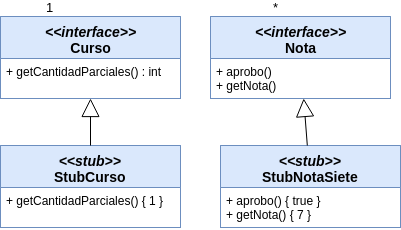

# Ejemplo de Testing con Stubs y Mocks - Alumnos

[](https://travis-ci.com/uqbar-project/eg-alumnos-xtend) [](https://coveralls.io/github/uqbar-project/eg-alumnos-xtend?branch=master)

 

## Objetivo

Muestra cómo testear con mocks y stubs cuando tenemos una aplicación parcialmente construida.

## Conceptos a ver

* Testeo unitario
* Generación de stubs 
* Generación de tests de expectativa mediante el uso de mocks que provee [Mockito](http://site.mockito.org/)


## Dominio

Tenemos modelado

* un alumno
 * con n cursadas

Cada cursada define

* el curso, con la cantidad de exámenes requeridos para aprobarlo
* un mapa que asocia como clave el número de parcial (1, 2, etc.) y como valor una lista de notas. Si el alumno aprueba en primera instancia habrá un solo elemento (ej. [8]). En caso contrario aparecerá la nota del parcial y sus correspondientes recuperatorios (ej: [2, 3, 7] si el alumno aprueba en el segundo recuperatorio)


**Todavía no tenemos la implementación de curso ni de nota**, pero queremos verificar si un alumno aprobó una materia (porque aprobó todos los exámenes de la cursada). Para eso generamos stubs y mocks.

## Stubs implementados a mano

Podemos implementar nuestros propios stubs, objetos que tienen un comportamiento mínimo pero que sirven para que podamos testear las clases Alumno y Curso.



En el caso del curso, forzamos a que haya un solo examen, y en el caso de la nota, elegimos una nota numérica cualquiera y decimos que aprobó. Esta **no será la implementación final que el usuario estará probando**, pero permite acotar la unitariedad de la prueba para saber si la cursada de un alumno está aprobada (porque nos interesa saber si el método aprobo() de Cursada está correctamente definido).

Incluso cuando tengamos la implementación final para Curso y Nota, podemos conservar los objetos stub para generar lo que Martin Fowler denomina [**test solitarios**](https://martinfowler.com/bliki/UnitTest.html)


## Stubs y mocks implementados con Mockito

Mockito permite _envolver_ las interfaces proveyendo respuestas cada vez que llamemos a un método. Esto lo pueden ver en el cualquiera de los archivos de test

```xtend
    def void init() {
        ...
        nota2 = mockearNota(2)      
        nota5 = mockearNota(5)
        nota10 = mockearNota(10)
        ...
    }
```

La clase MockHelpers tiene métodos _static_ que permiten configurar el comportamiento para cada mensaje que enviemos:

```xtend
    static def mockearNota(int nota) {
        val notaTemp = mock(Nota)
        when(notaTemp.nota).thenReturn(nota)          // cuando envíen el mensaje nota, devolvé el valor del parámetro nota
        when(notaTemp.aprobo).thenReturn(nota >= 4)   // cuando pregunten si aprobó, dependerá de que nota sea mayor o igual a 4
        notaTemp
    }
```

Lo mismo para Curso. Entonces cada vez que preguntemos a la referencia nota2 si aprobó, devolverá false. El método mockearNota permite generar objetos descartables para usar en los tests, sin necesidad de implementar clases concretas.

## Escenarios posibles

Podemos dividir los casos de prueba en dos grandes escenarios:

- un alumno recibido, que aprobó todas las materias
- un alumno que aprobó algunas materias y desaprobó otras

(podemos pensar más casos pero son subconjuntos de estos dos y para fines didácticos nos alcanza). Escribimos entonces dos archivos de tests que reflejen estos escenarios.

## Tests de estado (stub)

Mockito permite hacer tests de estado, es decir, una vez generada la dependencia de objetos: 

- un/a alumno/a
- cursando la materia Algoritmos 2
- cuyo curso tiene 2 parciales
- y con notas de aprobación en los recuperatorios

podemos verificar que aprobó la cursada.

```xtend
	@Test
	def void aproboAlgoritmos2() {
		assertTrue(cursadaAlgoritmos2.aprobo, "El alumno recibido debería tener aprobada Algo2")
	}
```

Pueden ver los tests del ejemplo que son más abarcativos que la presente explicación.

## Test de comportamiento

Pero además, Mockito permite establecer expectativas. Por ejemplo, para saber si el alumno recibido aprobó la cursada de Algoritmos 2 enviamos el mensaje aprobo() al objeto Cursada, que no debería preguntarle a Nota la nota numérica, sino delegar en Nota la pregunta (Nota tiene un método aprobo() que sirve para tal fin). Entonces podemos hacer el siguiente test:

```xtend
	@Test
	def void paraSaberSiAproboAlgoritmos2DelegamosBienEnClaseNota() {
		cursadaAlgoritmos2.aprobo
		#[nota2, nota5, nota10].forEach [ nota |
			verify(nota, never()).nota
			verify(nota, times(1)).aprobo
		]
	}
```

lo que evaluamos es que

- nunca se envió el mensaje nota() a ninguno de los objetos nota 
- exactamente una vez se envió el mensaje aprobo

Eso permite hacer pruebas a nivel diseño (verificamos correcta delegación), no solo respecto al estado esperado.
