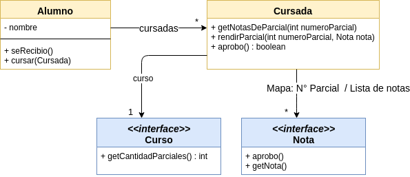

# Ejemplo de Testing con Stubs y Mocks - Alumnos

 

 

## Dominio
Tenemos modelado 

* un alumno
 * con n cursadas

Cada cursada define

* el curso, con la cantidad de exámenes requeridos para aprobarlo
* un mapa que asocia como clave el número de parcial (1, 2, etc.) y como valor la lista de notas (ej: [2, 3, 7] si el alumno aprueba en instancia de recuperación o bien [8] si el alumno aprueba en primera instancia)

**Todavía no tenemos la implementación de curso ni de nota**, pero queremos verificar si un alumno aprobó una materia (porque aprobó todos los exámenes de la cursada). Para eso generamos stubs y mocks.

## Objetivo

Muestra cómo testear con mocks y stubs cuando tenemos una aplicación parcialmente construida.

## Conceptos a ver

* Testeo unitario
* Generación de stubs 
* Generación de tests de expectativa mediante el uso de mocks que provee [Mockito](http://site.mockito.org/)

